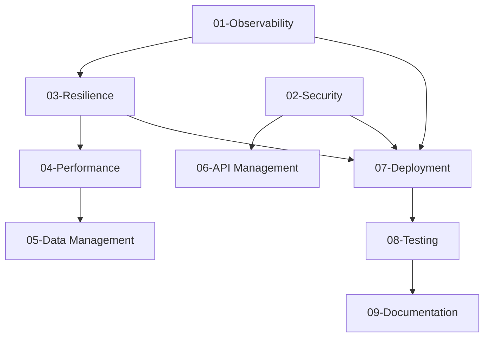

# Enterprise Enhancement Overview

## Repository Context
This is a Spring Boot 3.5.6 POC application that needs to be transformed into an enterprise production-ready system. The current application has:
- Java 21 with Gradle build
- OpenAPI-driven REST APIs
- OAuth2/JWT security
- PostgreSQL with Flyway migrations
- Testcontainers integration testing
- Docker Compose local development

## Critical Missing Components

### 1. Observability & Monitoring
**Status**: ❌ **Missing**
**Priority**: 🔴 **Critical**
**Plan File**: `01-observability-monitoring.md`

Current: Basic actuator endpoint only
Needed: Metrics, tracing, structured logging, APM

### 2. Security Hardening
**Status**: ⚠️ **Basic**
**Priority**: 🔴 **Critical** 
**Plan File**: `02-security-hardening.md`

Current: JWT validation only
Needed: Rate limiting, input validation, security headers, audit logging

### 3. Resilience & Fault Tolerance
**Status**: ❌ **Missing**
**Priority**: 🟡 **High**
**Plan File**: `03-resilience-fault-tolerance.md`

Current: No resilience patterns
Needed: Circuit breakers, retries, timeouts, bulkhead isolation

### 4. Performance & Caching
**Status**: ❌ **Missing**
**Priority**: 🟡 **High**
**Plan File**: `04-performance-caching.md`

Current: Basic JPA, no optimization
Needed: Connection pooling, caching, query optimization

### 5. Data Management
**Status**: ⚠️ **Basic**
**Priority**: 🟡 **High**
**Plan File**: `05-data-management.md`

Current: Simple entities with migrations
Needed: Auditing, archival, indexing, read replicas

### 6. API Management
**Status**: ⚠️ **Basic**
**Priority**: 🟠 **Medium**
**Plan File**: `06-api-management.md`

Current: OpenAPI spec only
Needed: Versioning, validation, pagination, documentation portal

### 7. Deployment & Infrastructure
**Status**: ⚠️ **Basic**
**Priority**: 🟠 **Medium**
**Plan File**: `07-deployment-infrastructure.md`

Current: Docker Compose for dev only
Needed: Production containers, K8s, CI/CD, environments

### 8. Testing Strategy
**Status**: ⚠️ **Basic**
**Priority**: 🟠 **Medium**
**Plan File**: `08-testing-strategy.md`

Current: Integration tests with Testcontainers
Needed: Performance tests, contract tests, chaos engineering

### 9. Documentation & Governance
**Status**: ⚠️ **Basic**
**Priority**: 🔵 **Low**
**Plan File**: `09-documentation-governance.md`

Current: README and AGENTS.md
Needed: Architecture docs, runbooks, compliance

## Implementation Phases

### Phase 1: Core Production Readiness (Weeks 1-2)
- **Files**: `01-observability-monitoring.md`, `02-security-hardening.md`
- **Goal**: Make application production-deployable
- **Deliverables**: Metrics, logging, basic security hardening

### Phase 2: Resilience & Performance (Weeks 3-4)
- **Files**: `03-resilience-fault-tolerance.md`, `04-performance-caching.md`
- **Goal**: Handle production load and failures gracefully
- **Deliverables**: Circuit breakers, caching, connection pooling

### Phase 3: Advanced Features (Weeks 5-6)
- **Files**: `05-data-management.md`, `06-api-management.md`
- **Goal**: Enterprise-grade data and API management
- **Deliverables**: Auditing, API versioning, comprehensive validation

### Phase 4: Production Deployment (Weeks 7-8)
- **Files**: `07-deployment-infrastructure.md`, `08-testing-strategy.md`
- **Goal**: Production deployment pipeline
- **Deliverables**: K8s manifests, CI/CD, comprehensive testing

### Phase 5: Governance & Compliance (Weeks 9-10)
- **Files**: `09-documentation-governance.md`
- **Goal**: Enterprise governance and compliance
- **Deliverables**: Documentation, compliance checks, monitoring

## Success Criteria

### Technical Metrics
- **Availability**: 99.9% uptime
- **Performance**: <100ms p95 response time
- **Security**: Zero critical vulnerabilities
- **Observability**: Full request tracing and metrics

### Operational Metrics
- **MTTR**: <15 minutes for critical issues
- **Deployment**: Zero-downtime deployments
- **Monitoring**: Real-time alerting and dashboards
- **Documentation**: Comprehensive runbooks

## Dependencies Between Plans

## AI Agent Instructions

### For Each Plan File
1. **Read the current repository state** using AGENTS.md
2. **Follow the specific plan** in the numbered files
3. **Maintain existing patterns** and code quality standards
4. **Run tests after each change** to ensure stability
5. **Update documentation** as changes are made

### Implementation Order
1. Start with `01-observability-monitoring.md` (foundational)
2. Follow numbered sequence for optimal dependency management
3. Each file is self-contained but may reference others
4. Always verify current state before making changes

### Quality Gates
- All tests must pass before moving to next enhancement
- Code must pass Spotless formatting
- Security scanning must pass
- Performance tests must meet SLA requirements

## Contact & Support
- **Architecture Questions**: Reference existing AGENTS.md
- **Implementation Issues**: Check specific plan file troubleshooting section
- **Testing Guidance**: See 08-testing-strategy.md

---
**Last Updated**: $(date)
**Version**: 1.0
**Status**: Planning Phase