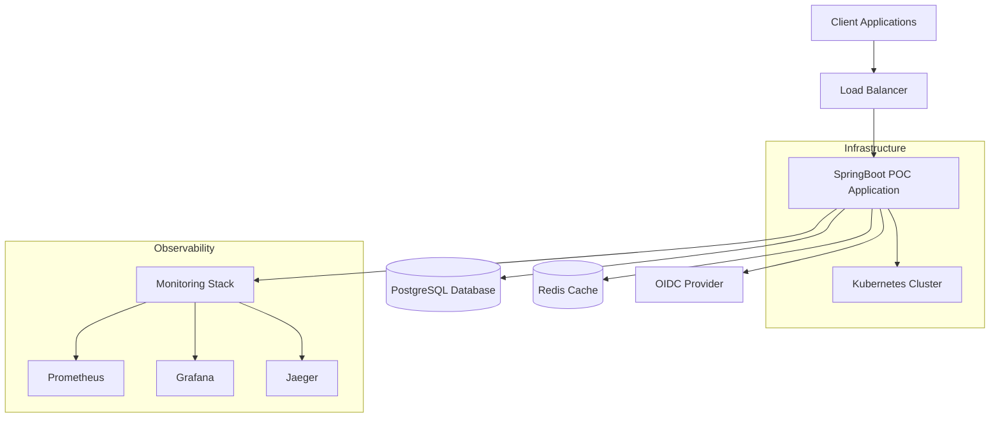
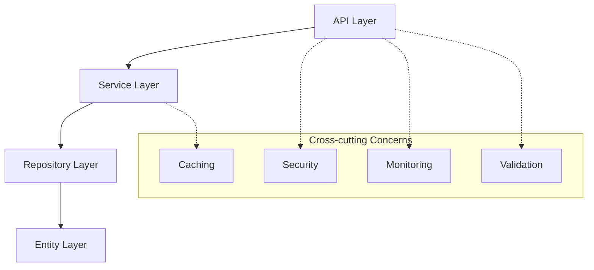
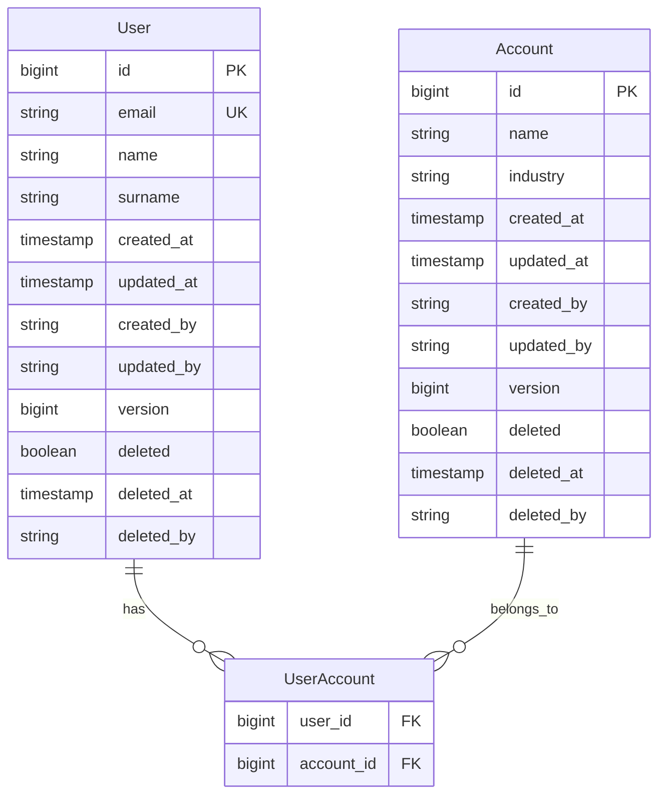
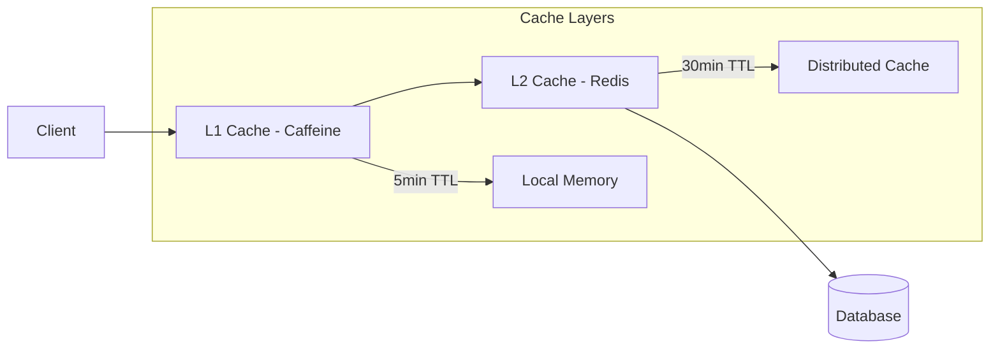
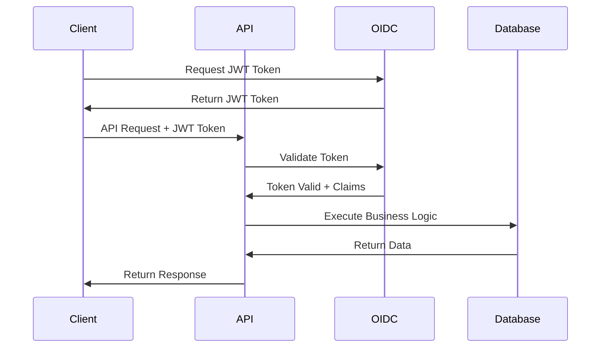
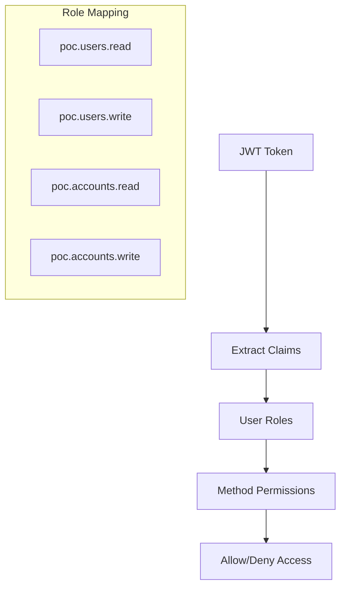
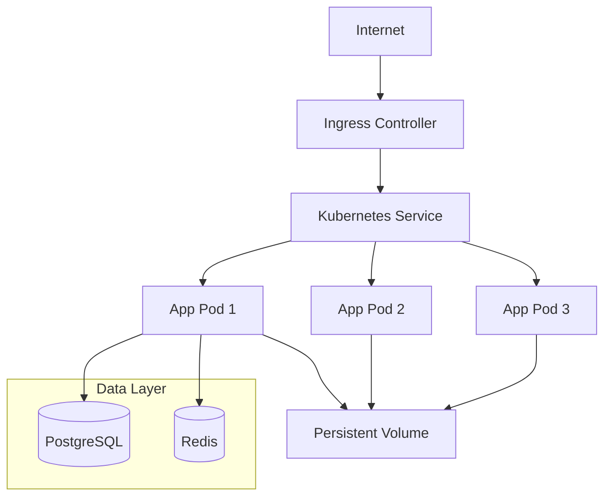
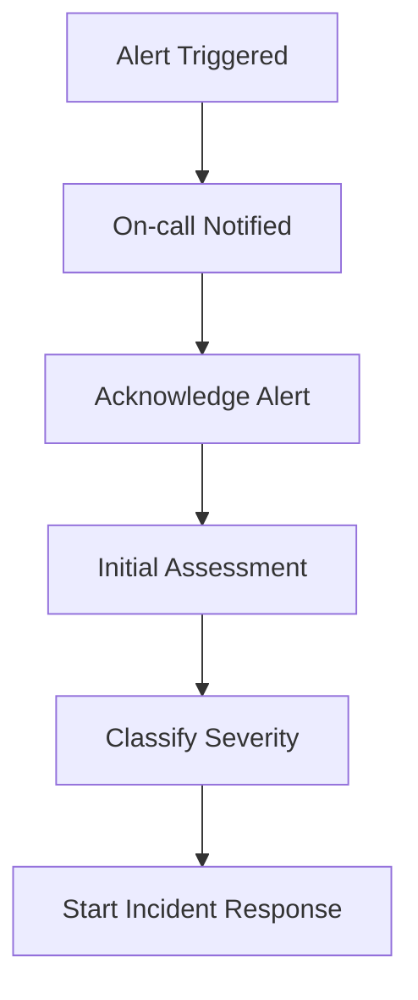
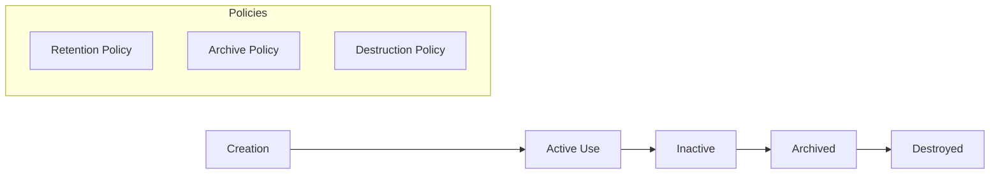

# Documentation & Governance Enhancement Plan

## Current State Analysis
- ✅ Basic README.md with setup instructions
- ✅ AGENTS.md for AI agent guidance
- ✅ LOCAL_OIDC_README.md for authentication setup
- ❌ No architecture documentation
- ❌ No API documentation beyond OpenAPI spec
- ❌ No operational runbooks
- ❌ No compliance documentation
- ❌ No governance processes
- ❌ No decision records

## Target State
- ✅ Comprehensive architecture documentation
- ✅ Detailed operational runbooks and procedures
- ✅ Compliance and security documentation
- ✅ Governance processes and decision records
- ✅ Code quality and contribution guidelines
- ✅ Monitoring and alerting documentation
- ✅ Disaster recovery procedures
- ✅ Knowledge management system

## Implementation Steps

### Step 1: Architecture Documentation

#### 1.1 Architecture Decision Records (ADRs)
Create `docs/architecture/adr/README.md`:
```markdown
# Architecture Decision Records (ADRs)

This directory contains Architecture Decision Records (ADRs) for the SpringBoot POC project.

## Index of ADRs

- [ADR-001: Architecture Pattern Selection](001-architecture-pattern-selection.md)
- [ADR-002: Database Technology Choice](002-database-technology-choice.md)
- [ADR-003: Security Framework Selection](003-security-framework-selection.md)
- [ADR-004: API Documentation Strategy](004-api-documentation-strategy.md)
- [ADR-005: Caching Strategy](005-caching-strategy.md)
- [ADR-006: Testing Strategy](006-testing-strategy.md)
- [ADR-007: Deployment Strategy](007-deployment-strategy.md)
- [ADR-008: Monitoring and Observability](008-monitoring-observability.md)

## ADR Template

Use the template in `template.md` for new ADRs.

## Status Definitions

- **Proposed**: Under consideration
- **Accepted**: Approved and implemented
- **Deprecated**: No longer recommended
- **Superseded**: Replaced by a newer decision
```

#### 1.2 ADR Template
Create `docs/architecture/adr/template.md`:
```markdown
# ADR-XXX: [Title]

## Status
[Proposed | Accepted | Deprecated | Superseded by ADR-XXX]

## Context
[Describe the forces at play, including technological, political, social, and project local. These forces are probably in tension, and should be called out as such.]

## Decision
[State the architecture decision and provide detailed justification.]

## Consequences
[Describe the resulting context, after applying the decision. All consequences should be listed here, not just the "positive" ones.]

### Positive
- [List positive consequences]

### Negative
- [List negative consequences]

### Neutral
- [List neutral consequences]

## Compliance
[If applicable, describe how this decision supports compliance requirements]

## Implementation
[Describe how this decision will be implemented]

## Related Decisions
[List any related ADRs]

## Notes
[Any additional notes or references]
```

#### 1.3 System Architecture Documentation
Create `docs/architecture/system-overview.md`:
```markdown
# System Architecture Overview

## Introduction

The SpringBoot POC is an enterprise-grade backend application demonstrating best practices for building secure, scalable REST APIs.

## Architecture Principles

### Core Principles
1. **API-First Design**: All interfaces defined using OpenAPI specifications
2. **Security by Design**: Authentication and authorization at every layer
3. **Observability**: Comprehensive logging, metrics, and tracing
4. **Resilience**: Circuit breakers, retries, and graceful degradation
5. **Scalability**: Horizontal scaling and performance optimization

### Design Patterns
- **Layered Architecture**: Clear separation of concerns
- **Repository Pattern**: Data access abstraction
- **Command Query Separation**: Read/write operation optimization
- **Event-Driven Architecture**: Asynchronous processing capabilities

## System Context



## Component Architecture

### Application Layers



### Core Components

#### API Layer
- **REST Controllers**: Handle HTTP requests and responses
- **Input Validation**: Request parameter and body validation
- **Error Handling**: Global exception handling and error responses
- **Security**: Authentication and authorization enforcement

#### Service Layer
- **Business Logic**: Core application functionality
- **Transaction Management**: Data consistency and integrity
- **Integration**: External service communication
- **Caching**: Performance optimization

#### Repository Layer
- **Data Access**: Database operations abstraction
- **Query Optimization**: Efficient data retrieval
- **Audit Logging**: Data change tracking

#### Entity Layer
- **Data Model**: JPA entities and relationships
- **Validation**: Entity-level constraints
- **Audit**: Change tracking and versioning

## Data Architecture

### Database Design



### Caching Strategy



## Security Architecture

### Authentication Flow



### Authorization Model



## Deployment Architecture

### Kubernetes Deployment



## Quality Attributes

### Performance
- **Response Time**: < 100ms p95 for read operations
- **Throughput**: 1000+ requests per second
- **Scalability**: Horizontal scaling capability

### Reliability
- **Availability**: 99.9% uptime target
- **Fault Tolerance**: Circuit breakers and retries
- **Data Consistency**: ACID transactions

### Security
- **Authentication**: JWT-based with OIDC
- **Authorization**: Role-based access control
- **Data Protection**: Encryption at rest and in transit

### Maintainability
- **Code Quality**: 90%+ test coverage
- **Documentation**: Comprehensive API and architecture docs
- **Monitoring**: Full observability stack
```

#### 1.4 Component Documentation
Create `docs/architecture/components/api-layer.md`:
```markdown
# API Layer Documentation

## Overview

The API layer serves as the entry point for all client interactions with the SpringBoot POC application. It handles HTTP requests, validates input, enforces security, and coordinates with the service layer.

## Components

### Controllers

#### UsersApiV2Impl
- **Purpose**: Handles user-related HTTP requests
- **Location**: `src/main/java/com/cekinmezyucel/springboot/poc/api/v2/UsersApiV2Impl.java`
- **Security**: Requires `poc.users.read` or `poc.users.write` roles
- **Features**:
  - Pagination and sorting support
  - Input validation
  - HATEOAS links
  - Error handling

#### Endpoints
| Method | Path | Description | Required Role |
|--------|------|-------------|---------------|
| GET | `/api/v2/users` | List users with pagination | `poc.users.read` |
| GET | `/api/v2/users/{id}` | Get user by ID | `poc.users.read` |
| POST | `/api/v2/users` | Create new user | `poc.users.write` |
| PUT | `/api/v2/users/{id}` | Update user | `poc.users.write` |
| DELETE | `/api/v2/users/{id}` | Soft delete user | `poc.users.delete` |

### Validation

#### Input Validation
```java
@Valid @RequestBody User user
```

#### Custom Validators
- Email format validation
- Name pattern validation
- Business rule validation

### Error Handling

#### Global Exception Handler
- **Location**: `GlobalExceptionHandler.java`
- **Features**:
  - Structured error responses
  - Security event logging
  - Correlation ID tracking

#### Error Response Format
```json
{
  "timestamp": "2024-01-01T12:00:00Z",
  "status": 400,
  "error": "Bad Request",
  "code": "VALIDATION_ERROR",
  "message": "Input validation failed",
  "path": "/api/v2/users",
  "traceId": "abc123",
  "details": {
    "email": "Email must be valid"
  }
}
```

## Security

### Authentication
- JWT tokens validated on every request
- Integration with OIDC provider
- Automatic token refresh support

### Authorization
- Method-level security with `@RolesAllowed`
- Role-based access control
- Fine-grained permissions

### Rate Limiting
- Per-user rate limiting
- Different limits per endpoint
- Graceful degradation

## Performance

### Caching
- Response caching for read operations
- Cache headers for browser caching
- ETags for conditional requests

### Pagination
- Cursor-based pagination support
- Configurable page sizes
- Performance-optimized queries

## Monitoring

### Metrics
- Request/response times
- Error rates
- Throughput metrics
- Cache hit rates

### Logging
- Structured JSON logging
- Correlation ID tracking
- Security event logging
- Performance logging

## Testing

### Unit Tests
- Controller method testing
- Validation testing
- Error handling testing

### Integration Tests
- Full API endpoint testing
- Security testing
- Performance testing

## Configuration

### Properties
```yaml
app:
  api:
    version: 2.0.0
    rate-limiting:
      enabled: true
      requests-per-minute: 100
    pagination:
      default-size: 20
      max-size: 100
```

## Related Documentation
- [Service Layer](service-layer.md)
- [Security Architecture](../security-architecture.md)
- [API Testing Guide](../../testing/api-testing.md)
```

### Step 2: Operational Runbooks

#### 2.1 Deployment Runbook
Create `docs/operations/runbooks/deployment.md`:
```markdown
# Deployment Runbook

## Overview

This runbook provides step-by-step procedures for deploying the SpringBoot POC application to different environments.

## Prerequisites

### Required Tools
- kubectl (v1.27+)
- helm (v3.12+)
- Docker (v20.10+)
- Access to container registry

### Required Access
- Kubernetes cluster access
- Container registry push/pull permissions
- Environment-specific secrets

## Deployment Environments

### Staging Environment
- **Cluster**: staging-k8s-cluster
- **Namespace**: springboot-poc-staging
- **URL**: https://staging-api.springboot-poc.com

### Production Environment
- **Cluster**: production-k8s-cluster
- **Namespace**: springboot-poc-production
- **URL**: https://api.springboot-poc.com

## Standard Deployment Procedure

### 1. Pre-deployment Checks

#### Verify Prerequisites
```bash
# Check kubectl access
kubectl cluster-info

# Check Helm
helm version

# Check Docker
docker version

# Verify container image exists
docker pull ghcr.io/company/springboot-poc:${VERSION}
```

#### Health Checks
```bash
# Check current application health
curl -f https://api.springboot-poc.com/actuator/health

# Check database connectivity
kubectl exec -n springboot-poc-production deployment/postgres -- pg_isready

# Check Redis connectivity
kubectl exec -n springboot-poc-production deployment/redis -- redis-cli ping
```

### 2. Deployment Steps

#### Standard Deployment
```bash
# 1. Set environment variables
export ENVIRONMENT=production
export VERSION=v1.2.3
export NAMESPACE=springboot-poc-${ENVIRONMENT}

# 2. Update Helm values if needed
vim helm/springboot-poc/values-${ENVIRONMENT}.yaml

# 3. Deploy using Helm
helm upgrade --install springboot-poc ./helm/springboot-poc \
  --namespace ${NAMESPACE} \
  --create-namespace \
  --values helm/springboot-poc/values-${ENVIRONMENT}.yaml \
  --set image.tag=${VERSION} \
  --wait --timeout=10m

# 4. Verify deployment
kubectl rollout status deployment/springboot-poc-app -n ${NAMESPACE}
```

#### Blue-Green Deployment
```bash
# 1. Deploy to green environment
helm upgrade --install springboot-poc-green ./helm/springboot-poc \
  --namespace ${NAMESPACE}-green \
  --create-namespace \
  --values helm/springboot-poc/values-${ENVIRONMENT}.yaml \
  --set image.tag=${VERSION} \
  --set ingress.hosts[0].host=green-api.springboot-poc.com \
  --wait --timeout=10m

# 2. Run smoke tests against green
./scripts/smoke-tests.sh green-api.springboot-poc.com

# 3. Switch traffic to green
kubectl patch ingress springboot-poc-ingress -n ${NAMESPACE} \
  --type='json' \
  -p='[{"op": "replace", "path": "/spec/rules/0/http/paths/0/backend/service/name", "value": "springboot-poc-green"}]'

# 4. Monitor for 5 minutes
./scripts/monitor-deployment.sh

# 5. Clean up blue environment
helm uninstall springboot-poc-blue -n ${NAMESPACE}-blue
```

### 3. Post-deployment Verification

#### Application Health
```bash
# Check application health
curl -f https://api.springboot-poc.com/actuator/health

# Check metrics endpoint
curl -f https://api.springboot-poc.com/actuator/prometheus

# Verify API functionality
curl -H "Authorization: Bearer ${TEST_TOKEN}" \
  https://api.springboot-poc.com/api/v2/users
```

#### Infrastructure Health
```bash
# Check pod status
kubectl get pods -n ${NAMESPACE}

# Check service endpoints
kubectl get endpoints -n ${NAMESPACE}

# Check ingress status
kubectl get ingress -n ${NAMESPACE}

# Check persistent volumes
kubectl get pv,pvc -n ${NAMESPACE}
```

#### Performance Verification
```bash
# Run performance tests
./scripts/performance-tests.sh ${ENVIRONMENT}

# Check response times
./scripts/check-response-times.sh

# Verify cache performance
./scripts/verify-cache-performance.sh
```

## Rollback Procedures

### Quick Rollback (Helm)
```bash
# List releases
helm history springboot-poc -n ${NAMESPACE}

# Rollback to previous version
helm rollback springboot-poc -n ${NAMESPACE}

# Verify rollback
kubectl rollout status deployment/springboot-poc-app -n ${NAMESPACE}
```

### Manual Rollback
```bash
# Scale down current deployment
kubectl scale deployment springboot-poc-app --replicas=0 -n ${NAMESPACE}

# Deploy previous version
helm upgrade springboot-poc ./helm/springboot-poc \
  --namespace ${NAMESPACE} \
  --set image.tag=${PREVIOUS_VERSION} \
  --wait --timeout=5m

# Verify rollback
curl -f https://api.springboot-poc.com/actuator/health
```

## Emergency Procedures

### Application Down
1. Check pod status and logs
2. Verify database connectivity
3. Check ingress and service configuration
4. Scale up replicas if needed
5. Execute emergency rollback if necessary

### Database Issues
1. Check database pod status
2. Verify persistent volume claims
3. Check database logs
4. Restore from backup if needed

### High Error Rate
1. Check application logs
2. Verify external service connectivity
3. Check rate limiting configuration
4. Scale up application replicas
5. Enable circuit breakers if not already active

## Monitoring and Alerting

### Key Metrics to Monitor
- Application response time
- Error rates
- Pod CPU and memory usage
- Database connection pool usage
- Cache hit rates

### Alert Thresholds
- Response time > 1 second (P95)
- Error rate > 5%
- Pod CPU usage > 80%
- Memory usage > 85%
- Database connections > 80% of pool

## Troubleshooting

### Common Issues

#### Pod Startup Failures
```bash
# Check pod events
kubectl describe pod ${POD_NAME} -n ${NAMESPACE}

# Check logs
kubectl logs ${POD_NAME} -n ${NAMESPACE}

# Check resource constraints
kubectl top pods -n ${NAMESPACE}
```

#### Service Discovery Issues
```bash
# Check service endpoints
kubectl get endpoints -n ${NAMESPACE}

# Check service configuration
kubectl describe service springboot-poc-service -n ${NAMESPACE}

# Test service connectivity
kubectl exec -n ${NAMESPACE} deployment/springboot-poc-app -- \
  curl -f http://springboot-poc-service/actuator/health
```

#### Database Connectivity
```bash
# Check database pod
kubectl get pods -l app=postgres -n ${NAMESPACE}

# Test database connection
kubectl exec -n ${NAMESPACE} deployment/springboot-poc-app -- \
  pg_isready -h postgres-service -p 5432 -U pocuser
```

## Contact Information

### On-call Rotation
- Primary: DevOps Team
- Secondary: Development Team
- Escalation: Engineering Manager

### Emergency Contacts
- Slack: #springboot-poc-alerts
- PagerDuty: SpringBoot POC Service
- Email: springboot-poc-oncall@company.com
```

#### 2.2 Incident Response Runbook
Create `docs/operations/runbooks/incident-response.md`:
```markdown
# Incident Response Runbook

## Incident Classification

### Severity Levels

#### Severity 1 (Critical)
- **Definition**: Complete service outage affecting all users
- **Response Time**: 15 minutes
- **Examples**: Application completely down, database unavailable, security breach

#### Severity 2 (High)
- **Definition**: Significant service degradation affecting many users
- **Response Time**: 30 minutes
- **Examples**: High error rates, slow response times, authentication issues

#### Severity 3 (Medium)
- **Definition**: Service degradation affecting some users
- **Response Time**: 2 hours
- **Examples**: Feature not working, non-critical API endpoints down

#### Severity 4 (Low)
- **Definition**: Minor issues with minimal user impact
- **Response Time**: 24 hours
- **Examples**: Documentation issues, minor bugs, cosmetic problems

## Incident Response Process

### 1. Detection and Alert


### 2. Initial Response (0-15 minutes)

#### Immediate Actions
1. **Acknowledge the alert** in monitoring system
2. **Join the incident channel** (#incident-springboot-poc)
3. **Assess the situation** using monitoring dashboards
4. **Determine severity level** based on impact
5. **Notify stakeholders** if Severity 1 or 2

#### Quick Health Checks
```bash
# Application health
curl -f https://api.springboot-poc.com/actuator/health

# Kubernetes status
kubectl get pods -n springboot-poc-production

# Database health
kubectl exec -n springboot-poc-production deployment/postgres -- pg_isready

# Cache health
kubectl exec -n springboot-poc-production deployment/redis -- redis-cli ping
```

### 3. Investigation and Diagnosis (15-60 minutes)

#### Diagnostic Checklist
- [ ] Check application logs for errors
- [ ] Review monitoring dashboards
- [ ] Verify infrastructure status
- [ ] Check recent deployments
- [ ] Review external service status

#### Log Analysis
```bash
# Application logs
kubectl logs -n springboot-poc-production deployment/springboot-poc-app --tail=100

# Database logs
kubectl logs -n springboot-poc-production deployment/postgres --tail=100

# System events
kubectl get events -n springboot-poc-production --sort-by='.lastTimestamp'
```

#### Monitoring Dashboards
- **Application Dashboard**: http://grafana.company.com/d/springboot-poc-app
- **Infrastructure Dashboard**: http://grafana.company.com/d/springboot-poc-infra
- **Database Dashboard**: http://grafana.company.com/d/springboot-poc-db

### 4. Mitigation and Resolution

#### Common Mitigation Strategies

##### High CPU/Memory Usage
```bash
# Scale up replicas
kubectl scale deployment springboot-poc-app --replicas=5 -n springboot-poc-production

# Check resource limits
kubectl describe pod ${POD_NAME} -n springboot-poc-production
```

##### Database Connection Issues
```bash
# Check connection pool metrics
curl https://api.springboot-poc.com/actuator/metrics/hikaricp.connections.active

# Restart application pods
kubectl rollout restart deployment/springboot-poc-app -n springboot-poc-production
```

##### High Error Rates
```bash
# Check circuit breaker status
curl https://api.springboot-poc.com/actuator/health

# Review recent changes
helm history springboot-poc -n springboot-poc-production

# Rollback if needed
helm rollback springboot-poc -n springboot-poc-production
```

##### Security Issues
```bash
# Scale down to zero (emergency)
kubectl scale deployment springboot-poc-app --replicas=0 -n springboot-poc-production

# Block suspicious IPs at ingress level
kubectl patch ingress springboot-poc-ingress -n springboot-poc-production --patch-file security-patch.yaml
```

### 5. Communication

#### Stakeholder Notification

##### Internal Teams
- **Development Team**: Technical details and assistance
- **Product Team**: User impact and business implications
- **Support Team**: Customer communication coordination
- **Management**: High-severity incidents only

##### External Communication
- **Status Page**: Update company.statuspage.io
- **Customer Support**: Brief support team for user inquiries
- **Social Media**: Only for major outages with management approval

#### Communication Templates

##### Initial Notification (Severity 1-2)
```
INCIDENT: SpringBoot POC - [Brief Description]
Severity: [Level]
Impact: [User impact description]
Status: Investigating
ETA: [Estimated resolution time]
Updates: Will provide updates every 30 minutes
```

##### Resolution Notification
```
RESOLVED: SpringBoot POC - [Brief Description]
Duration: [Start time - End time]
Root Cause: [Brief description]
Resolution: [What was done to fix]
Follow-up: Post-incident review scheduled for [date/time]
```

## Post-Incident Activities

### 1. Post-Incident Review (PIR)

#### PIR Template
```markdown
# Post-Incident Review: [Incident Title]

## Summary
- **Date**: 
- **Duration**: 
- **Severity**: 
- **Impact**: 

## Timeline
- **Detection**: 
- **Response Started**: 
- **Mitigation Applied**: 
- **Resolution**: 

## Root Cause Analysis
### What Happened
[Detailed description]

### Why It Happened
[Root cause analysis]

### Contributing Factors
[Environmental or process factors]

## Response Evaluation
### What Went Well
- [List positive aspects]

### What Could Be Improved
- [List improvement areas]

## Action Items
| Action | Owner | Due Date | Status |
|--------|-------|----------|--------|
| [Action description] | [Person] | [Date] | [Status] |

## Lessons Learned
[Key takeaways]
```

### 2. Follow-up Actions

#### Immediate (Within 24 hours)
- Schedule PIR meeting
- Update monitoring and alerting
- Implement temporary fixes
- Communicate lessons learned

#### Short-term (Within 1 week)
- Implement permanent fixes
- Update runbooks and documentation
- Improve monitoring coverage
- Review and test backup procedures

#### Long-term (Within 1 month)
- Architectural improvements
- Process improvements
- Training and knowledge sharing
- Technology upgrades if needed

## Emergency Contacts

### Escalation Path
1. **On-call Engineer** (Primary response)
2. **Engineering Manager** (Severity 1-2 incidents)
3. **VP Engineering** (Extended outages, security issues)
4. **CTO** (Business-critical impacts)

### Contact Methods
- **Slack**: #incident-springboot-poc
- **PagerDuty**: SpringBoot POC Service
- **Phone**: Emergency contact list
- **Email**: incident-response@company.com

### External Vendors
- **Cloud Provider**: [Support contact]
- **OIDC Provider**: [Support contact]
- **Monitoring Service**: [Support contact]

## Training and Drills

### Regular Drills
- **Monthly**: Incident response simulation
- **Quarterly**: Disaster recovery testing
- **Annually**: Full system recovery test

### Training Materials
- Incident response documentation
- System architecture overview
- Monitoring and alerting guide
- Communication procedures
```

### Step 3: Compliance and Governance

#### 3.1 Security and Compliance Documentation
Create `docs/compliance/security-controls.md`:
```markdown
# Security Controls Documentation

## Overview

This document outlines the security controls implemented in the SpringBoot POC application to ensure data protection, privacy, and regulatory compliance.

## Security Framework

### Standards Compliance
- **OWASP Top 10**: Application security best practices
- **ISO 27001**: Information security management
- **SOC 2 Type II**: Security, availability, and confidentiality
- **GDPR**: Data protection and privacy (where applicable)

## Authentication and Authorization

### Control ID: IAM-001
**Control**: Multi-factor authentication required for all administrative access
- **Implementation**: OIDC provider with MFA enforcement
- **Testing**: Automated tests verify MFA requirement
- **Monitoring**: Authentication events logged and monitored

### Control ID: IAM-002
**Control**: Role-based access control (RBAC) for application features
- **Implementation**: JWT claims-based authorization with @RolesAllowed
- **Testing**: Authorization tests for all endpoints
- **Monitoring**: Access attempts logged with user context

### Control ID: IAM-003
**Control**: Regular access review and privilege management
- **Implementation**: Quarterly access reviews
- **Documentation**: Access review reports
- **Monitoring**: Privileged account activity monitoring

## Data Protection

### Control ID: DP-001
**Control**: Encryption of data in transit
- **Implementation**: TLS 1.3 for all communications
- **Testing**: TLS configuration testing
- **Monitoring**: Certificate expiration monitoring

### Control ID: DP-002
**Control**: Encryption of sensitive data at rest
- **Implementation**: Database encryption, encrypted storage volumes
- **Testing**: Encryption verification procedures
- **Monitoring**: Encryption status monitoring

### Control ID: DP-003
**Control**: Data classification and handling procedures
- **Implementation**: Data classification schema, handling guidelines
- **Documentation**: Data handling procedures
- **Training**: Staff training on data handling

## Application Security

### Control ID: AS-001
**Control**: Input validation and sanitization
- **Implementation**: Comprehensive input validation using Bean Validation
- **Testing**: Validation bypass testing, fuzzing
- **Monitoring**: Input validation failures logged

### Control ID: AS-002
**Control**: Secure coding practices
- **Implementation**: Code review requirements, security scanning
- **Testing**: Static and dynamic security testing
- **Monitoring**: Security scan results tracking

### Control ID: AS-003
**Control**: Vulnerability management
- **Implementation**: Regular dependency scanning, patch management
- **Testing**: Penetration testing (quarterly)
- **Monitoring**: Vulnerability scan results and remediation tracking

## Infrastructure Security

### Control ID: IS-001
**Control**: Network segmentation and firewalls
- **Implementation**: Kubernetes network policies, security groups
- **Testing**: Network penetration testing
- **Monitoring**: Network traffic monitoring

### Control ID: IS-002
**Control**: Container security and image scanning
- **Implementation**: Container image scanning, security policies
- **Testing**: Container security testing
- **Monitoring**: Runtime security monitoring

### Control ID: IS-003
**Control**: Secrets management
- **Implementation**: Kubernetes secrets, external secret management
- **Testing**: Secret rotation testing
- **Monitoring**: Secret access logging

## Monitoring and Incident Response

### Control ID: MIR-001
**Control**: Security event logging and monitoring
- **Implementation**: Comprehensive security logging, SIEM integration
- **Testing**: Log integrity testing
- **Monitoring**: Real-time security event monitoring

### Control ID: MIR-002
**Control**: Incident response procedures
- **Implementation**: Documented incident response playbooks
- **Testing**: Incident response drills (monthly)
- **Monitoring**: Incident response metrics tracking

### Control ID: MIR-003
**Control**: Regular security assessments
- **Implementation**: Quarterly security assessments
- **Documentation**: Assessment reports and remediation plans
- **Monitoring**: Security posture tracking

## Compliance Reporting

### Audit Trail
- All security events logged with timestamp, user, and action
- Immutable audit logs with integrity protection
- Long-term retention for compliance requirements

### Compliance Metrics
| Metric | Target | Current | Frequency |
|--------|--------|---------|-----------|
| Security Incident Response Time | < 15 minutes | [Current] | Real-time |
| Vulnerability Remediation Time | < 30 days | [Current] | Weekly |
| Access Review Completion | 100% | [Current] | Quarterly |
| Security Training Completion | 100% | [Current] | Annually |

### Regulatory Mapping

#### GDPR Compliance (if applicable)
- **Data Minimization**: Only collect necessary data
- **Purpose Limitation**: Use data only for stated purposes
- **Right to Erasure**: Soft delete implementation
- **Data Portability**: API endpoints for data export
- **Consent Management**: User consent tracking

#### SOC 2 Controls
- **Security**: Multi-layered security controls
- **Availability**: High availability design and monitoring
- **Processing Integrity**: Data validation and error handling
- **Confidentiality**: Encryption and access controls
- **Privacy**: Privacy controls and procedures

## Testing and Validation

### Security Testing Types
1. **Static Application Security Testing (SAST)**
2. **Dynamic Application Security Testing (DAST)**
3. **Interactive Application Security Testing (IAST)**
4. **Dependency Scanning**
5. **Container Security Scanning**
6. **Infrastructure Security Testing**

### Testing Schedule
- **Daily**: Automated security scans
- **Weekly**: Dependency vulnerability checks
- **Monthly**: Manual security testing
- **Quarterly**: Penetration testing
- **Annually**: Comprehensive security audit

## Security Metrics and KPIs

### Key Performance Indicators
- Mean Time to Detection (MTTD)
- Mean Time to Response (MTTR)
- Security Incident Frequency
- Vulnerability Remediation Rate
- Compliance Score

### Reporting
- **Daily**: Security dashboard updates
- **Weekly**: Security metrics report
- **Monthly**: Executive security summary
- **Quarterly**: Compliance status report
- **Annually**: Security program assessment
```

#### 3.2 Data Governance Documentation
Create `docs/compliance/data-governance.md`:
```markdown
# Data Governance Framework

## Overview

This document establishes the data governance framework for the SpringBoot POC application, defining policies, procedures, and responsibilities for data management.

## Data Governance Principles

### Core Principles
1. **Data Quality**: Ensure accuracy, completeness, and consistency
2. **Data Security**: Protect data confidentiality, integrity, and availability
3. **Data Privacy**: Respect user privacy and comply with regulations
4. **Data Accessibility**: Provide authorized access to data when needed
5. **Data Retention**: Manage data lifecycle appropriately

## Data Classification

### Classification Levels

#### Public Data
- **Definition**: Data that can be freely shared without risk
- **Examples**: Marketing materials, public API documentation
- **Handling**: No special protection required
- **Retention**: Indefinite

#### Internal Data
- **Definition**: Data intended for internal use only
- **Examples**: Internal procedures, system configurations
- **Handling**: Access control required
- **Retention**: 7 years or business need

#### Confidential Data
- **Definition**: Sensitive data requiring protection
- **Examples**: User personal information, business data
- **Handling**: Encryption, access logging, need-to-know basis
- **Retention**: Legal requirements or business need

#### Restricted Data
- **Definition**: Highly sensitive data with legal/regulatory implications
- **Examples**: Authentication data, financial information
- **Handling**: Strong encryption, audit logging, minimal access
- **Retention**: Regulatory requirements

## Data Inventory

### Application Data

#### User Data
| Field | Classification | Purpose | Retention |
|-------|---------------|---------|-----------|
| ID | Internal | Unique identifier | Indefinite |
| Email | Confidential | User identification | Active + 7 years |
| Name | Confidential | User identification | Active + 7 years |
| Surname | Confidential | User identification | Active + 7 years |
| Created Date | Internal | Audit trail | Indefinite |
| Updated Date | Internal | Audit trail | Indefinite |

#### Account Data
| Field | Classification | Purpose | Retention |
|-------|---------------|---------|-----------|
| ID | Internal | Unique identifier | Indefinite |
| Name | Confidential | Business identification | Active + 10 years |
| Industry | Internal | Business classification | Active + 10 years |
| Created Date | Internal | Audit trail | Indefinite |
| Updated Date | Internal | Audit trail | Indefinite |

#### Audit Data
| Field | Classification | Purpose | Retention |
|-------|---------------|---------|-----------|
| Action | Internal | Change tracking | 7 years |
| User | Confidential | Accountability | 7 years |
| Timestamp | Internal | Temporal tracking | 7 years |
| Details | Internal | Change details | 7 years |

## Data Quality Management

### Data Quality Metrics
- **Accuracy**: 99%+ data accuracy target
- **Completeness**: 95%+ required field completion
- **Consistency**: 100% referential integrity
- **Timeliness**: Real-time data updates
- **Validity**: 100% format compliance

### Quality Monitoring
```yaml
# Data Quality Checks
checks:
  - name: email_format_validation
    rule: email MATCHES regex pattern
    frequency: real-time
    threshold: 100%
  
  - name: referential_integrity
    rule: all foreign keys valid
    frequency: daily
    threshold: 100%
  
  - name: completeness_check
    rule: required fields not null
    frequency: hourly
    threshold: 95%
```

### Data Quality Procedures
1. **Input Validation**: Real-time validation at data entry
2. **Batch Validation**: Scheduled data quality checks
3. **Exception Handling**: Automated quality issue detection
4. **Remediation**: Defined procedures for quality issues

## Data Privacy and Protection

### Privacy by Design
- **Proactive**: Privacy measures built into system design
- **Default Setting**: Maximum privacy protection by default
- **Embedded**: Privacy considerations in all system components
- **Full Functionality**: No unnecessary trade-offs
- **End-to-End Security**: Secure data lifecycle management
- **Visibility**: Transparency in data practices
- **User-Centric**: User control over personal data

### Data Subject Rights (GDPR)
1. **Right to Information**: Clear privacy notices
2. **Right of Access**: Data portability APIs
3. **Right to Rectification**: Data update capabilities
4. **Right to Erasure**: Soft delete implementation
5. **Right to Restrict Processing**: Processing flags
6. **Right to Data Portability**: Export functionality
7. **Right to Object**: Opt-out mechanisms

### Privacy Controls
- **Data Minimization**: Collect only necessary data
- **Purpose Limitation**: Use data only for stated purposes
- **Storage Limitation**: Implement retention policies
- **Accuracy**: Maintain data accuracy
- **Integrity and Confidentiality**: Secure data processing
- **Accountability**: Document compliance measures

## Data Lifecycle Management

### Lifecycle Stages



### Retention Policies

#### User Data
- **Active Period**: While user account is active
- **Inactive Period**: 1 year after last login
- **Archive Period**: 6 years for compliance
- **Destruction**: Secure deletion after archive period

#### Business Data
- **Active Period**: While business relationship exists
- **Inactive Period**: 2 years after relationship ends
- **Archive Period**: 8 years for financial compliance
- **Destruction**: Secure deletion after archive period

#### Audit Data
- **Active Period**: 1 year
- **Archive Period**: 6 years additional
- **Destruction**: Secure deletion after 7 years total

### Data Archival Process
1. **Identification**: Automated identification of archival candidates
2. **Validation**: Verify data meets archival criteria
3. **Migration**: Move data to archive storage
4. **Verification**: Confirm successful archival
5. **Cleanup**: Remove data from active systems

### Data Destruction Process
1. **Authorization**: Approval for data destruction
2. **Verification**: Confirm retention period expired
3. **Destruction**: Secure data deletion
4. **Certification**: Document destruction completion
5. **Audit**: Verification of destruction

## Data Access Management

### Access Principles
- **Least Privilege**: Minimum necessary access
- **Need to Know**: Access based on business need
- **Segregation of Duties**: Separation of critical functions
- **Regular Review**: Periodic access certification

### Access Roles
| Role | Data Access | Permissions |
|------|-------------|-------------|
| Application User | Own data only | Read, Update |
| Data Administrator | All application data | Read, Update, Delete |
| Security Administrator | Audit data | Read |
| System Administrator | Configuration data | Read, Update |

### Access Controls
- **Authentication**: Multi-factor authentication
- **Authorization**: Role-based access control
- **Logging**: All access attempts logged
- **Monitoring**: Real-time access monitoring

## Compliance and Audit

### Compliance Requirements
- **GDPR**: General Data Protection Regulation
- **CCPA**: California Consumer Privacy Act
- **SOX**: Sarbanes-Oxley Act (if applicable)
- **Industry Standards**: Relevant industry regulations

### Audit Procedures
1. **Regular Audits**: Quarterly compliance audits
2. **Risk Assessments**: Annual privacy impact assessments
3. **Compliance Monitoring**: Continuous compliance monitoring
4. **Corrective Actions**: Prompt remediation of issues

### Documentation Requirements
- **Data Flow Diagrams**: Visual data movement mapping
- **Privacy Notices**: User-facing privacy information
- **Procedures**: Detailed operational procedures
- **Training Records**: Staff training documentation

## Roles and Responsibilities

### Data Governance Committee
- **Data Owner**: Business stakeholders
- **Data Steward**: IT operations team
- **Privacy Officer**: Legal/compliance team
- **Security Officer**: Information security team

### Responsibilities Matrix
| Role | Policy | Implementation | Monitoring | Compliance |
|------|--------|----------------|------------|------------|
| Data Owner | Define | Approve | Review | Accountable |
| Data Steward | Input | Execute | Monitor | Responsible |
| Privacy Officer | Define | Guide | Audit | Accountable |
| Security Officer | Input | Implement | Monitor | Responsible |

## Training and Awareness

### Training Programs
- **New Employee**: Data governance orientation
- **Role-Specific**: Targeted training by role
- **Regular Updates**: Annual refresher training
- **Incident Response**: Specialized incident training

### Awareness Activities
- **Communications**: Regular data governance updates
- **Resources**: Self-service training materials
- **Metrics**: Training completion tracking
- **Feedback**: Continuous improvement based on feedback
```

## Validation Checklist

### ✅ Architecture Documentation
- [ ] System overview and context diagrams
- [ ] Component architecture documentation
- [ ] Data architecture and flow diagrams
- [ ] Security architecture documentation
- [ ] Decision records maintained

### ✅ Operational Procedures
- [ ] Deployment runbooks created
- [ ] Incident response procedures documented
- [ ] Monitoring and alerting guides
- [ ] Disaster recovery procedures
- [ ] Maintenance procedures

### ✅ Compliance Documentation
- [ ] Security controls documented
- [ ] Data governance policies defined
- [ ] Privacy procedures implemented
- [ ] Audit procedures established
- [ ] Training programs defined

### ✅ Knowledge Management
- [ ] Documentation structure organized
- [ ] Search capabilities implemented
- [ ] Version control for documents
- [ ] Review and update procedures
- [ ] Access controls for sensitive docs

## Troubleshooting

### Common Documentation Issues
1. **Outdated information**: Implement regular review cycles
2. **Missing documentation**: Establish documentation requirements
3. **Inaccessible documentation**: Improve organization and search
4. **Inconsistent formats**: Standardize templates and styles
5. **No ownership**: Assign documentation owners and reviewers

### Best Practices
- Use clear, concise language
- Include diagrams and examples
- Maintain version history
- Regular reviews and updates
- Cross-reference related documents

## Next Steps
After implementing documentation and governance:
1. Establish regular review and update cycles
2. Implement documentation automation where possible
3. Create training programs for documentation usage
4. Set up metrics for documentation quality and usage
5. Continuous improvement based on user feedback

## AI Agent Notes
- Always update documentation when making system changes
- Use consistent terminology and formatting across documents
- Include practical examples and troubleshooting guidance
- Maintain traceability between decisions and implementations
- Regular validation of documented procedures against actual practices